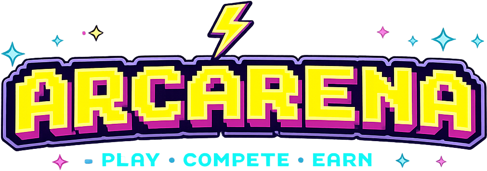

  

# 🎮 ArcArena: The Ultimate On-Chain Dueling Ground

ArcArena is a decentralized, turn-based competitive gaming platform built natively on the **Arc Network**. We bring the thrill of high-stakes arcade matches to Web3, where players can bet securely, play seamlessly, and claim their winnings through a trustless smart contract system. 

Forget about centralized servers holding your funds. ArcArena strictly adheres to the ethos of true self-custody: your wallet, your keys, your winnings. 

### ⚡ Powered by Arc Network

By leveraging the **Arc Testnet**, ArcArena delivers a frictionless and lightning-fast gaming experience. Arc Network's robust infrastructure ensures that creating rooms, locking bets, and claiming prizes happen securely and transparently, without the frustrating latency of traditional chains.

---

### 🔥 Key Features

* **Custom Lobbies & Matchmaking:** Jump into the global lobby to find an opponent, or create your own room. You set the rules: choose your game, set your wager, and decide if the room is public for everyone or private for a specific challenger. 
* **Trustless Escrow System:** Say goodbye to shady house rules. When a match starts, both players' bets are locked securely in our on-chain escrow smart contract. No middleman can touch your funds.
* **Turn-Based Battles:** Engage in seamless turn-based gameplay where every move counts. Once both players are ready, the arena locks in.
* **Winner Takes All:** When the dust settles and the game ends, the winner can instantly claim 2x the bet directly to their wallet via a secure cryptographic signature.
* **Dynamic Player Profiles:** Customize your Web3 identity. Change your avatar, update your username, and keep track of your hard-earned stats (Total Points, Win Rate, PnL, and Match History).
* **Global Leaderboard:** Prove you are the best. Rack up points with every victory and climb the global ranks.

---

### 🕹️ How It Works (The Flow)

1. **Create or Join:** Connect your Web3 wallet (MetaMask, Rabby, etc.) and browse the active rooms. Create a new room with a set bet, or join an existing one.
2. **Lock the Bet:** Once you join a room, you approve the transaction in your wallet. The bet is securely deposited into the Escrow Smart Contract.
3. **Ready Up & Play:** Both players hit "Ready" and the turn-based game begins. Outsmart your opponent.
4. **Settle & Claim:** The game concludes off-chain for zero latency, and the result is signed. The winner submits this signed payload to the blockchain to instantly claim the pooled prize from the escrow contract.

---

### 💻 Tech Stack

ArcArena is built with a modern, performance-driven stack designed for the Web3 gaming era:

* **Frontend:** React, UI/UX libraries for a sleek, neon-arcade aesthetic.
* **Web3 Integration:** Wagmi, RainbowKit (for seamless mobile & desktop wallet connections), Ethers.js / Viem.
* **Blockchain:** Solidity Smart Contracts deployed on **Arc Testnet**.
* **Backend/Oracle:** Node.js server handling real-time socket connections and cryptographic signature generation.

---
